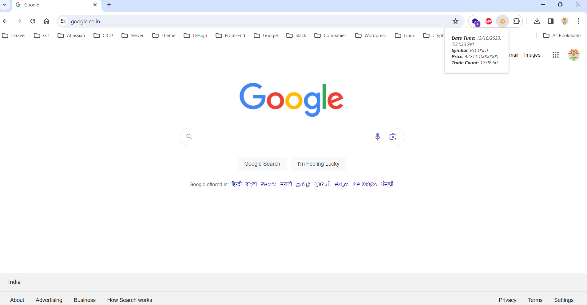

# Google Chrome Extension - Fetch Binance current Price of BTCUSDT

Below is a simple example of a Chrome extension that fetches data from a Binance API and displays it in the extension popup.

Step 1: Create a new directory for your extension and add the following files:

```
manifest.json
popup.html
popup.js
```

Step 2: manifest.json:

This file defines the metadata and settings for the Chrome extension.

```json
{
  "name": "Binance Exchange BTCUSDT Current Price",
  "description": "Fetch Binance current Price of BTCUSDT",
  "version": "1.0",
  "manifest_version": 3,
  "minimum_chrome_version": "116",
  "action": {
    "default_icon": "icons/logo.png",
    "default_popup": "popup.html"
  },
  "icons": {
    "48": "icons/logo.png"
  }
}
```
Step 3: popup.html:

This file defines the HTML structure of the extension popup.

```html
<!DOCTYPE html>
<html>
<head>
  <title>Fetch Binance current Price of BTCUSDT</title>
  <style>
    body {
      width: 130px;
      padding: 10px;
    }

    #data-container {
      font-style: italic;
      color: #333;
    }
  </style>
  <script src="popup.js"></script>
</head>
<body>
  <div id="data-container">Loading...</div>
</body>
</html>
```

Step 4: popup.js:

This script fetches data from a public API and updates the popup.

```js
document.addEventListener('DOMContentLoaded', function () {
  fetchData();
});

function fetchData() {
  fetch('https://api.binance.com/api/v3/ticker/24hr?symbol=BTCUSDT')
    .then(response => response.json())
    .then(data => {
      const dataContainer = document.getElementById('data-container');
      var d = new Date(data.closeTime);

      dataContainer.innerHTML = `
        <b>Date Time:</b> ${d.toLocaleString()}<br>
        <b>Symbol:</b> ${data.symbol}<br>
        <b>Price:</b> ${data.lastPrice}<br>
        <b>Trade Count:</b> ${data.count}
      `;
    })
    .catch(error => {
      console.log('Error fetching data:'+ error);
      const dataContainer = document.getElementById('data-container');
      dataContainer.textContent = 'Error fetching data';
    });
}
```
Step 5: Icons:

Create icon images for your extension and place them in an "icons" directory within your extension directory.

Step 6: Load the extension (Test -> Developer Mode):

```
6.1 Open Chrome and go to chrome://extensions/.
6.2 Enable "Developer mode" at the top right.
6.3 Click "Load unpacked" and select the directory where your extension files are located.
```

Now, when you click on the extension icon, it will show a popup with data fetched from the Binance API.

## Screenshots



## Live 

Step 7: Goto https://chrome.google.com/webstore/devconsole/register

Step 8: Pay Registration Fees

Step 9: Fill the business name and address

Step 10: Goto 'Chrome Web Store Developer Dashbaord' -> Choose 'Items' 

Step 11: Upload your compressed (.zip) file

Step 12: Once Upload, Fill the following details:

```
12.1 Category (Communication/Developer Tools/Education and more)
12.2 Language (English, Tamil and more)
Grpahic Assets 
 * Store Icon -> It Should be 128x128 pixels and PNG format
 * Screenshots -> Up to a maximum of 5 1280x800 or 640x400 JPEG or 24-bit PNG (no alpha) At least one is required
 12.3 Additional Fields : We can add URLs
```

## Google Web Store Link

<a href="https://chromewebstore.google.com/detail/binance-exchange-btcusdt/imhkoobjomcpacnobbepjiikflbogced?hl=en" target="_blank" rel="noreferrer">
</a>


## Note

Items staged to be published later will expire 30 days after they have passed review.

## Support

For support, email bmahendranmca@gmail.com